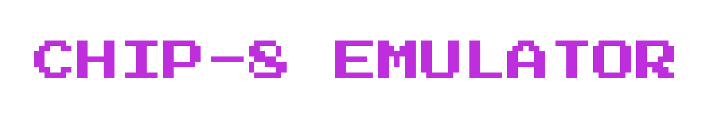
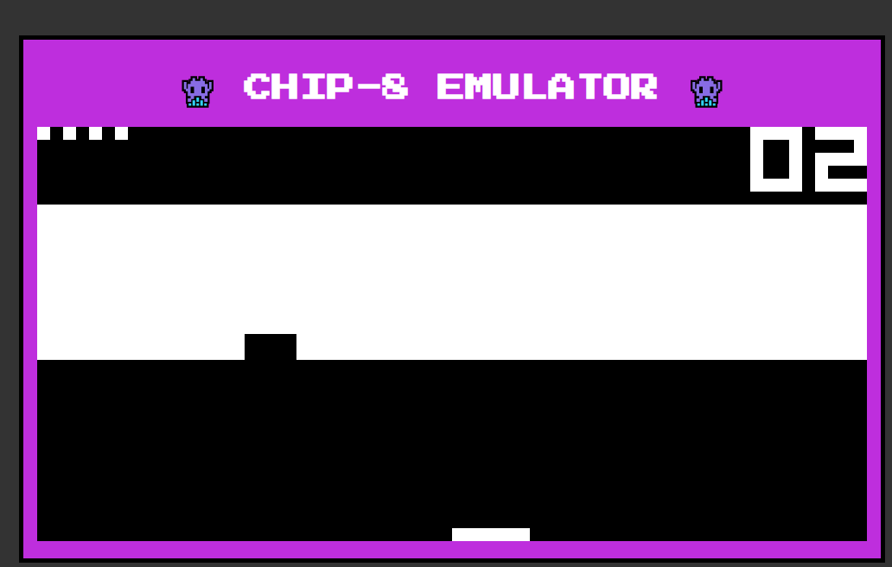

[DEMO](https://chip8.iamankush.me/)

CHIP-8 is an interpreted programming language, developed by Joseph Weisbecker. It was initially used on the COSMAC VIP and Telmac 1800 8-bit microcomputers in the mid-1970s. CHIP-8 programs are run on a CHIP-8 virtual machine. It was made to allow video games to be more easily programmed for these computers.

This repo is written from [this article](https://www.freecodecamp.org/news/creating-your-very-own-chip-8-emulator/).

